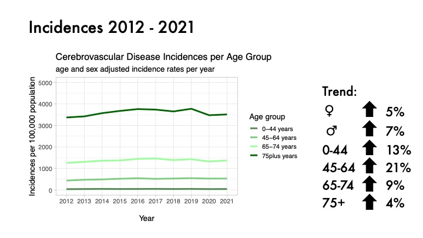
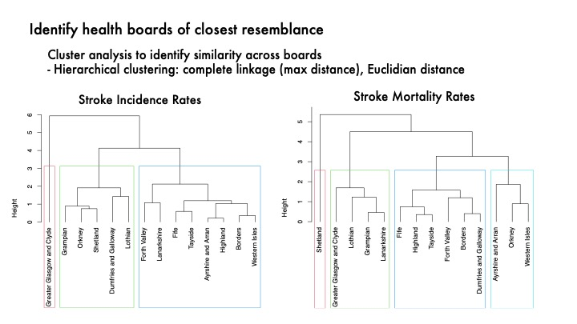

# PHS Scottish Stroke Statistics

## Project description

This project is an individual project assigned during the CodeClan Professional Data Analysis Course.

__In this project I analyse stroke (or: cerebrovascular disease) incidence and mortality rates in Scotland, using data from Public Health Scotland (PHS).__

__Main aim is to predict future stroke incidences using regression modelling and provide advice for health planning and collaboration between health boards using cluster analysis.__

__Disclaimer:__ this project was not requested by and had no involvement from PHSor NHS Scotland, and any result or insights are not intended to be used in real life.

## Brief overview

In this project data from Public Health Scotland (PHS) on stroke activity (including incidence- and mortality rates) across Scotland is analysed. General insights within and across the Scottish health boards are presented. 

  1.  Main goal is to build a predictive model using logistic regression to calculate the number of future stroke incidences per health board based on future population projections as released by National Records of Scotland (NRS).
  2. A clustering analysis is done on health board level given incidence and mortality pattern changes over the past years to advice on collaborative teams. 
  3. A leaflet-generated interactive map is created to identify health boards with similar levels of stroke incidences per given year.
  
At the end of the project key insights, findings and visualisations were presented to peers and stakeholders through a data presentation.

## Process

The following stages of the data analysis process were followed:

  1.	Data exploration (of internal data sources) to understand the available data, its quality, and what would be possible to analyse, including identification of meaningful KPIs.
  2.	Additional research/literature study to understand key terms of the stroke statistics data, e.g. diagnosis and admission types.
  3.	Planning and setting out exploration and analysis questions (e.g. setting out goals for the regression model). – iteratively developed throughout.
  4.	Choosing datasets, both internal data sources and external data sources as required for the model building.
  5.	Git repository design/folder structure and version control.
  6.	Final data cleaning and wrangling based on chosen datasets in step 4. Prepare the files for steps 7 and 8.
  7.	Statistical analyses and visualisations to create plots: including time series, bar charts and maps (using Leaflet in separate notebook).
  8.	Advanced statistics: A). analyse and manually build the logistic regression model; B). perform hierarchical clustering analysis.
  9.	Prepare presentation and communicate key insights and findings through data presentation.

## Observations and insights of interest

_We observed a decrease of mortality rates due to cerebrovascular disease across major demographic groups (age groups and sex) in Scotland over the period 2012-2021. The decrease in mortality rates varied between -30% (Females) and -18% (age group 65-74 yrs). Only the age group 45-64 yrs increased with 3%. (death rates are age- and sex- standardised, using the European standard population ESP2013)_

_In contrast to mortality, the incidence rates of cerebrovascular disease increased across all major demographic groups (age groups and sex) in Scotland over the period 2012-2021. The increase in incidence rates varied between 21% (age group 45-64 yrs) and 4% (age group 75+). (incidence rates are age- and sex- standardised, using the European standard population ESP2013)_

_Major differences and similarities are found between health boards comparing mortality- and incidence rate pattern changes over the period 2012-2021. Here incidence rates of cerebrovascular disease are shown per health board._

_A hierarchical clustering analysis approach identified health boards with highest similarity in incidence and mortality pattern changes. This insight is helpful for setting up collaborative teams._

_The interactive plot as generated with leaflet can be used to explore differences and similarities across healthboards. Here a screenshot is shown of the incidence rates, given per 100k population sizes. By hoovering over the boards, additional information and insights are presented._

For the construction of the predictive model we have seen that all predictors (of interest) show to be non-significant in terms of predicting proportion of strokes (when added in a single predictor model). This potentially tells us that our data might be too aggregated and we have too little variables that can explain/predict stroke incidences in a (future) population. 
Future steps might include: 

  1. augment the data; 
  2. use de-aggregated non-anonymised data;
  3. perform time series forecasting.

## R scripts and notebooks for cleaning and analysis, and final presentation

Various R notebooks and scripts cover the data exploration and analysis steps:

  * [R script: cleaning/wrangling steps of 'raw' PHS data](/scripts/clean_data.R)
  * [R notebook: explorative analysis and visualisations of stroke activity across Scotland](/notebooks/analysing_stroke_data.Rmd)
  * [R notebook: analysis and construction steps of predictive classifier through regression modelling](/notebooks/modelling_stroke_data.Rmd)
  * [R notebook: cluster analysis using hierarchical clustering of NHS health boards](/notebooks/clustering_stroke_data.Rmd)
  * [R notebook: spatial analysis through creation of leaflet interactive map](/notebooks/analysing_spatial_stroke_data.Rmd)
  
Key insights and findings where presented during a 15-minute presentation to peers and stakeholders [PDF of slides](/outputs/final_presentation_.pdf)

## About the data

__Internal sources__

This project uses data from Public Health Scotland and NHS Scotland, which contains public sector information licensed under the Open Government Licence v3.0.

The following internal data sources are sourced from the organisation’s Scottish Stroke Statistics page. Found [here:](https://www.opendata.nhs.scot/dataset/scottish-stroke-statistics)

Main analysis, modelling and clustering analysis is based on Stroke Statistics on Health Board level:

  * Stroke Activity by Health Board (43,200 data rows):
  https://www.opendata.nhs.scot/dataset/scottish-stroke-statistics/resource/47656572-e196-40c8-83e8-08b0b223b2e6
  *	Stroke Mortality by Health Board (8,100 data rows):
  https://www.opendata.nhs.scot/dataset/scottish-stroke-statistics/resource/19c01b59-6cf7-42a9-876a-b07b9b92d6eb

Exploration notebooks also include work using Stroke Statistics on Council Area level:

  *	Stroke Activity by Council Area (95,040 data rows):
  https://www.opendata.nhs.scot/dataset/scottish-stroke-statistics/resource/b80202b1-0ad8-4f40-a326-f9966872c4eb
  *	Stroke Mortality by Council Area (17,820 data rows):
  https://www.opendata.nhs.scot/dataset/scottish-stroke-statistics/resource/285b4cbd-1e87-49fe-9e24-73d2da8166ae

__External sources__

For the construction/analysis of the predictive model, predicting future stroke incidence rates, population estimates have been used as published by the National Records Scotland (NRS).

  *	Mid-Year Population Estimates by NHS health board, sex and single year of age, 1981-2021:
  https://www.nrscotland.gov.uk/statistics-and-data/statistics/statistics-by-theme/population/population-estimates/mid-year-population-estimates/population-estimates-time-series-data
  
  Main table is found on sheet 5, Table_2 from: Mid-Year Population Estimates for 
  Scotland, mid-2021: Time Series data
  Source: National Records of Scotland (NRS)
  Publication date: 13/07/2022

For the spatial analysis, construction of the interactive leaflet plot, shapefiles are used to outline the geometric forms/locations of the health board areas.

  *	ESRI Shapefiles from the NHS Health Boards are downloaded from the SpatialData.gov.scot webpage:
  https://spatialdata.gov.scot/geonetwork/srv/eng/catalog.search#/metadata/f12c3826-4b4b-40e6-bf4f-77b9ed01dc14

## Analytical tools, software and packages used

  * The code is written in R (version 4.3.0)
    R Core Team (2023). _R: A Language and Environment for Statistical Computing_. 
    R Foundation for Statistical Computing, Vienna, Austria.
   <https://www.R-project.org/>

  * R is run in Rstudio 2023.03.0+386
  
  * The following libraries are used/required:
    - `tidyverse`(ver 2.0.0)
    - `readxl` (ver 1.4.2)
    - `janitor` (ver 2.2.0)
    - `skimr` (ver 2.1.5)
    - `GGally` (ver 2.1.2)
    - `modelr` (ver 0.1.11)
    - `broom` (ver 1.0.4)
    - `ggfortify` (ver 0.4.16)
    - `leaps` (ver 3.1)
    - `glmulti` (ver 1.0.8)
    - `sf` (ver 1.0-13)
    - `leaflet` (ver 2.1.2)
    - `jsonlite` (ver 1.8.4)
    - `rgdal` (ver 1.6-7)
    - `htmlwidgets` (ver 1.6.2)
    - `cluster` (ver 2.1.4)
    - `corrplot` (ver 0.92)
    - `dendextend` (ver 1.17.1)
    - `factoextra` (ver 1.0.7)

## Licensing

As indicated above this project uses data from Public Health Scotland and NHS Scotland, which contains public sector information licensed under the [Open Government Licence v3.0](https://www.nationalarchives.gov.uk/doc/open-government-licence/version/3/).

